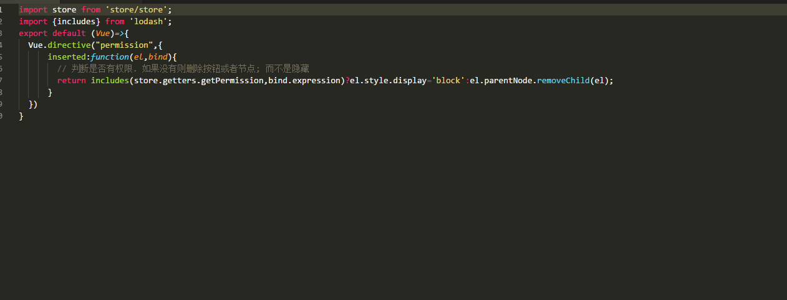
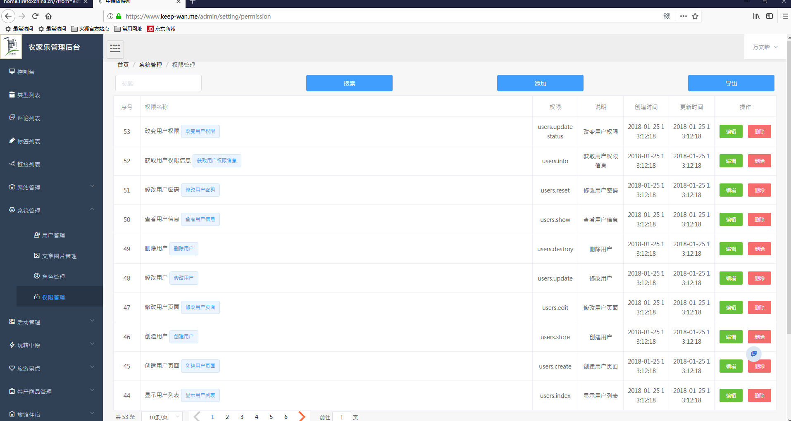
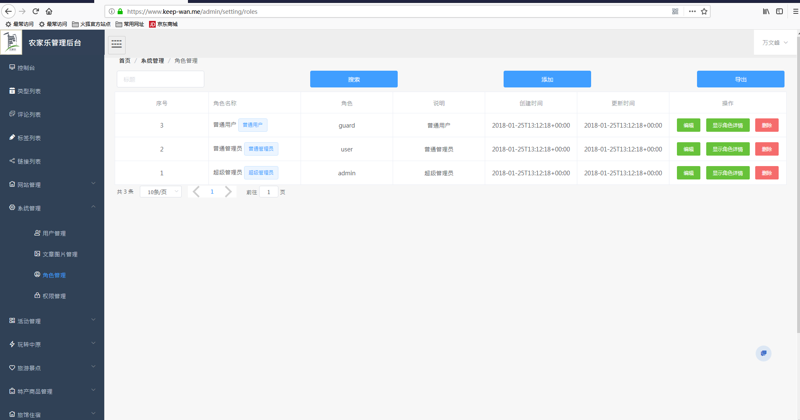

#在线体验地址
[万家山庄农家乐](http://www.keep-wan.me "万家山庄农家乐")
> 超级管理员账号 13265616949 密码:E1w>l}g4=6r%
> 普通管理员 13755869377 密码: 123456


[](./srccen/1.png "按钮权限指令")
[](./srccen/2.png "按钮权限指令")
[](./srccen/permission.png "权限管理")
[](./srccen/usre.png "用户管理")
[](./srccen/role.png "角色管理")

### 主要特性

- 完全前后端分离的rbac权限系统；
- 支持权限细分到按钮级别
- 菜单这部分由前端控制.其余权限则完全有后台控制；
- 基于element-ui 2.0跟vue2.5.X
- 基于RESTful API前后端分离.
- 有点赞.收藏.评论.以及关注功能
- 兼容主流的浏览器,最低兼容ie11;
- 由于我对后台不是很熟悉.而且我现在技术栈已经转向angular 跟.net core ,所以这个项目就开源了.主要是为一些还在为权限跟权限细分苦苦挣扎的朋友提供一些解决思路；
# 安装前说明
1. php版本最低7.0以上;
2. mysql 版本最低5.7以上;
3. composer 这个必须安装.
4. node版本最低 6.X以上.
5. larave版本最低5.3以上
# 后台安装
1. 首先安装Composer ,这个是php 类似npm 的依赖管理工具来着
2. 进入目录运行 `composer install` 安装laravel 以及依赖;
3.  运行  命令  `cp .env.example .env` 复制laravel 环境配置然后修改.env 中的数据库名.数据库密码改为自己的;
4. 运行 `php artisan key:generate` 生成唯一密钥;
5. 运行 `php artisan jwt:secret` 生成jwt 密钥
6. 运行 `php artisan migrate` 进行数据迁移
7. 运行 `php artisan db:seed` 进行数据填充

[TOCM]

> @pandao

### 前端安装
执行命令：`npm install` 或者 `yarn` 安装前端依赖
然后执行  `yarn run dev` 或者 `npm run dev` 编译为开发环境
执行 `yarn run prod` 或者 `npm run prod` 编译为生产环境

#### 项目说明
```
权限那块是使用的  rbac 权限.   三个层面控制全新啊  控制展现路由跳转权限.控制按钮,控制api权限;
//这里是控制路由显示的权限;
首先登入后验证密码后返回token 给前端.前端把token 缓存. 然后再路由拦截进行判断是否存在token.跟路由的meta 是否存在required 验证字段如果存在并需要验证就异步请求后台用户数据
角色数据跟权限数据  (ps: 注意权限数据跟角色数据不做缓存是为了安全性.只有有token 才能获取权限跟角色用户信息;一旦浏览器关闭也就没有了这些数据了),  异步请求权限跟角色信息后匹配路由的meta 里面的permission 权限字段如果是admin 角色直接放行所有路由权限;如果是普通用户或者普通管理员就匹配权限;
//控制按钮权限  注册个全局指令, 然后再按钮上使用这个指令 例如: v-permission='btn-permission'; 当 指令中的值 也就是btn-permission不存在权限中的时候就移除这个按钮.存在就显示这个按钮;
//  后台api 路由那里控制 RESTful API 请求权限, 再laravel 中注册个中间件.判断请求的路由是否存在于权限中. 如果不存在就返回 401 状态码; ,然后把这个中间件用在路由中;
//token是通过vuex中的setToken 来自动注入到请求头中.不用每次手动写请求头; 
```
### End